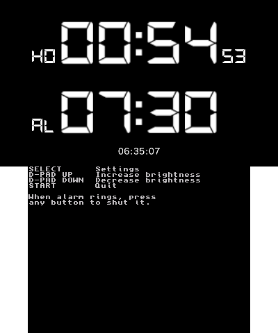

# CTR Alarmo
A simple, configurable alarm clock app for the Nintendo 3DS made with libctru



## Features
* Regular audible beep
* Power/Wireless/News LEDs blink support
* 2 ring modes (Static \& Progressive)
* Rings for 10 minutes, then sleeps 5 minutes before ringing again
* Adjustable screens brightness
* Sleep mode persistence (no sound/LEDs only)

New features would may be added in the future.

## Usage
Alarm time can be set from Settings menu: Press `SELECT` (hotkeys are listed on bottom screen) then look for "Redefine alarm".

Adjust other settings depending on your preferences.

## Compiling
Main compilation requires [devkitPro](https://github.com/devkitPro/installer/releases) with libctru, citro2D, citro3D libs properly installed.
For CIA generation, you'll need to install [`bannertool`](https://github.com/diasurgical/bannertool/releases), [`3dstool`](https://github.com/dnasdw/3dstool/releases/tag/v1.2.6) and [`makerom`](https://github.com/3DSGuy/Project_CTR/releases/tag/makerom-v0.18.4) into your path if not done yet.

- Available targets
```shell
make 3dsx  # Outputs ELF and 3DSX
make cia   # Outputs CIA
make all   # Alias for both 3dsx and cia targets
make clean # Cleans generated files
```
